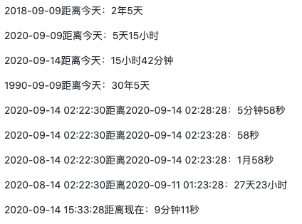

# time-ago

时长计算方法

## 使用方法

```
/*
startTime 为必填参数，表示开始时间；
endTime 可不填，不填的话为当前时间；
config: {
    typeMap: {
        year: '年',
        month: '月',
        day: '天',
        hour: '小时',
        minute: '分钟',
        second: '秒',
    },
    step: 2,   // 保留长度
    isData: false //是否返回数据
}
*/
timeAgo(startTime, endTime, config)
```

## 示例

<div align="left">
    
</div>

```jsx
import React, { useState, useEffect } from 'react';
import timeAgo from './src/index.js';
export default function Demo() {
    const [num, setNum] = useState(1);
    useEffect(() => {
        const sio = setInterval(() => setNum((num) => num + 1), 1000);
        return () => clearInterval(sio);
    }, []);
    return (
        <div>
            <p>2018-09-09距离今天：{timeAgo('2018-09-09')}</p>
            <p>2020-09-09距离今天：{timeAgo('2020-09-09')}</p>
            <p>2020-09-14距离今天：{timeAgo('2020-09-14')}</p>
            <p>1990-09-09距离今天：{timeAgo('1990-09-09')}</p>
            <p>
                2020-09-14 02:22:30距离2020-09-14 02:28:28：
                {timeAgo('2020-09-14 02:22:30', '2020-09-14 02:28:28')}
            </p>
            <p>
                2020-09-14 02:22:30距离2020-09-14 02:23:28：
                {timeAgo('2020-09-14 02:22:30', '2020-09-14 02:23:28')}
            </p>
            <p>
                2020-08-14 02:22:30距离2020-09-14 02:23:28：
                {timeAgo('2020-08-14 02:22:30', '2020-09-14 02:23:28')}
            </p>
            <p>
                2020-08-14 02:22:30距离2020-09-11 01:23:28：
                {timeAgo('2020-08-14 02:22:30', '2020-09-11 01:23:28')}
            </p>
            <p>2020-09-14 15:33:28距离现在：{timeAgo('2020-09-14 15:33:28')}</p>
        </div>
    );
}
```
